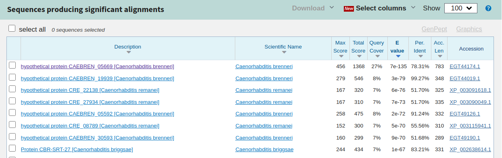

# Documentation

## Serching for the best gene prediction
The spice is a nematode so we do the prediction with the **FGENESH** 
with the spice *Caenorhabditis brenneri* and we get [FGENESHSeq.fa](FGENESHSeq.fa), and with **GeneID** we use the nematode *Caenorhabditis elegans* to do the prediction and we get [GeneID.gff](GeneID.gff) and finally with **GENESCAN** we do the prediction and and get [GENESCANSeq.fa](GENESCANSeq.fa).

Now we convert the **GeneID** to a fasta file.

~~~
bedtools getfasta -fi contig_13.fa -bed GeneID.gff >geneID_Trans.fa
~~~

Now we have the *.gff* file converted to fasta format, now we have to canocatenate the exons and create the document [geneIdSingelLine.fa](geneIdSingelLine.fa).

Now we concatenate all the fasta files to compare the to see witch one is better with **T-Cofee** MS simple test.

~~~
cat contig_13.fa FGENESHSeq.fa geneIdSingelLine.fa GENESCANSeq.fa > preictedAll.fa
~~~

The [results](results1.html) of the **T-Cofee** analisis are favorable to **FGENESH** so these are the more acurate gene prediction of these 3 methods.
___
## Gene prediction with BLASTX
First we do a **BlastX** to ser for the [contig_13.fa](contig_13.fa) in the **nr database**.

We 

