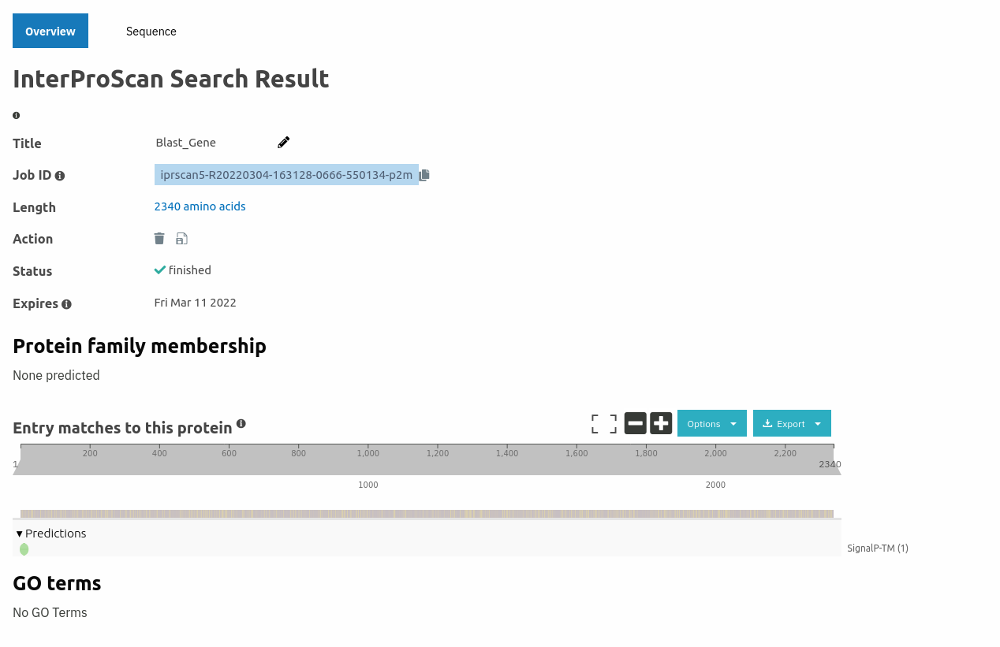
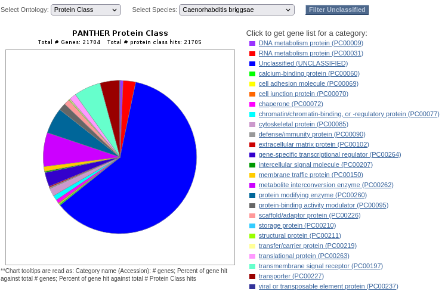

# Introduction

With the knowledge learned during these practical sessions we are going to try to compute a transcription and translation from our contig. 

The main objectives were to annotate the genes included in our contig and to functionally characterize the predicted proteins. We will have to find of which organism the sequence is, by comparing the protein sequence with the protein sequence of other nematode. 
# Methods

First of all we have used blastx to determine from the contig13 the proteins that we can obtain from this sequence related to our organism. After that, we store the protein fasta of one of the matches, the one with the smallest e-value.                    

After that, we pick up the first two possible proteins which are the ones with more probability, which are caenorhabditis briggsae and caenorhabditis remanei.

Then we used the following commands of bash to proceed with the homology based techniques:
~~~
exonerate -m p2g --showtargetgff -q CAEBRENhypo.fa -t contig_13.fa -S F | egrep -w exon > CAEBREN.exonerate.gff
~~~
This command it’s used to look after the coinciding exons and with the egrep we save the values to look carefully after them.
~~~
bedtools getfasta -fi contig_13.fa -bed CAEBREN.exonerate.gff > exonerate_hypo.fa
~~~
With this command we obtained a fasta from the gff generated by exonerate to look for them in an easier way.
~~~
sed -e '2,$s/>.*//' exonerate_hypo.fa |grep -v '^$' > exonerate_hypo_singleLine.fa
~~~
And with this last command we located the information of the exons and we created a text file with only the sequence of nucleotides.

# Results
## Ab Initio
In the [geneID](abInitio/genes/geneIdGene1.fa) we catche 1 gene and 13 exons, with the [FGENESH](anInitio/FGENESH.fa) we catch 2 genes and 15 exons and finally with the [GENESCAN](abInitio/GENESCAN.fa) with 2 genes.

We have determined that FGENESH and GENESCAN that have 2 genes we catch the more centric of the 2 to comaprate becaus the other ones are situated in oposite extremes.

To proof that the genes are the same we do a [TCOFEE](abInitio/TCOFFEE/analysis2.png) of them.

## Homology based
The gene of the blasx is one of the spices *Caenorhabditis brenneri* is the same gene as the Ab Initio verified with the aligment done in the [TCOFFEE](abInitio/TCOFFEE/analisis3.png)

## Functional anotation
In the  we have no go terms.

To validate that we have no go terms and it's not an error we do a panther serch of the *Caenorhabditis brenneri* and we observe that the majority of the genome is not anotated so is very probable that the gene is not anotated.

# Conclusion
We can't anotate the gene because the *Caenorhabditis brenneri* have a lot of the regions not anotated and these gene in specific **CAEBREN_05669** is a strange gene that usually doesn't express so they dont have cientific evidence to especify the function. 